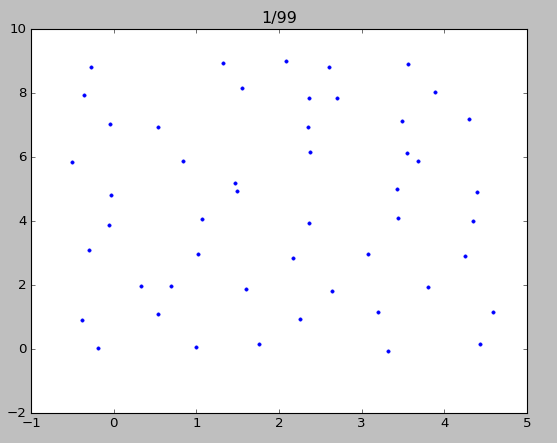
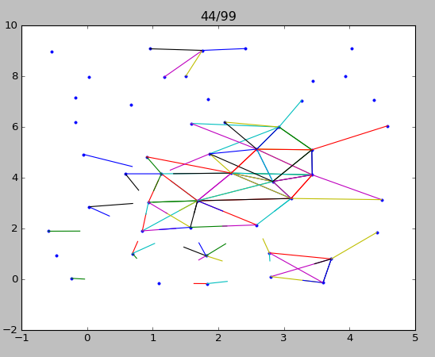
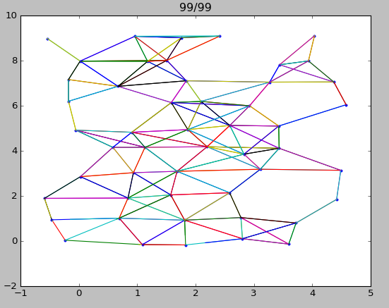
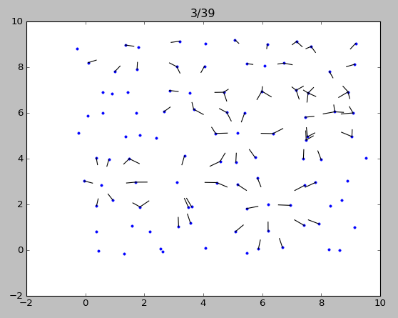
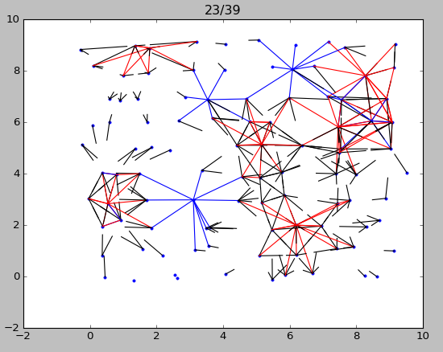
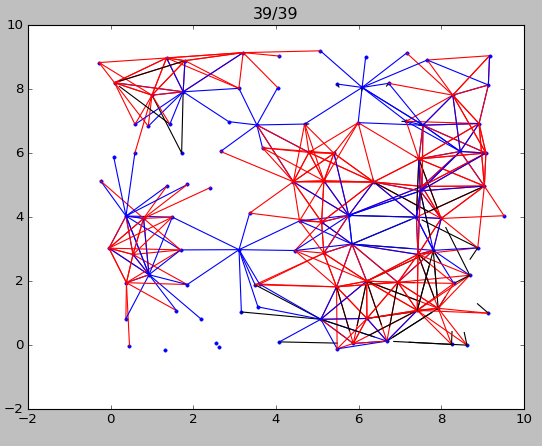

### Briefing

#### Step I
1) 2D dimension  
2) dendrites grow to active spiking neurons  
3) they grow to neighbor neurons in radius value  

Start | Middle | End
----| ----- | ----
 |  | 

#### Step II
1) add randomized list of inhibitory neurons (set % of their population)  
2) add randomized list of neurons ID with generators (set % of their population)  
3) add function for writing all data to files:  
- monitoring (analyse neuron connection and time for simulation and network initialization)  
- neurons info (id, coords, neighbors, transmitter type)  
- database (neuron, spike activity, membrane potential)  

4) in draw method add colors for neurotransmitters (red - Glu, blue - GABA)  
5) add script for reading and visualizing data  

Start | Middle | End
----| ----- | ----
 |  | 
